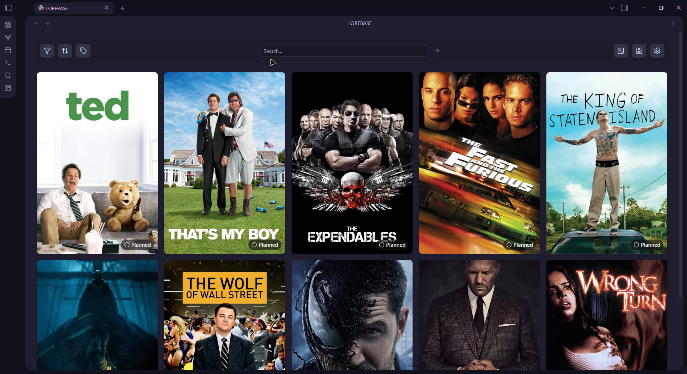
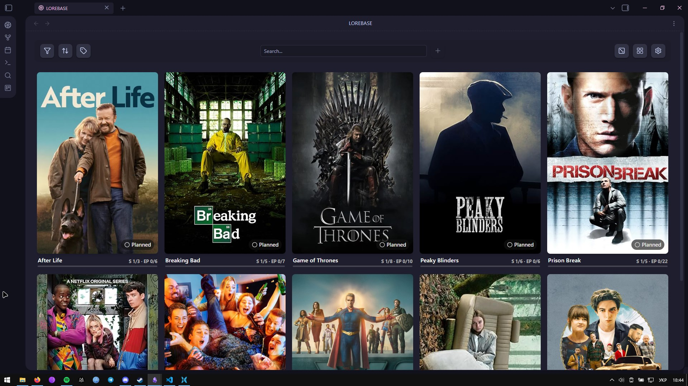
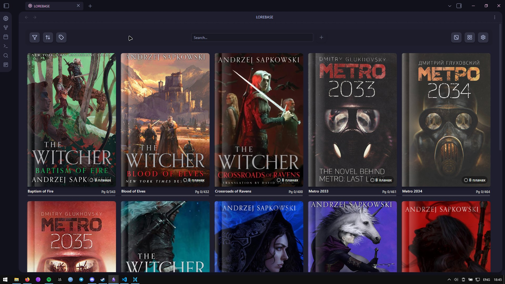
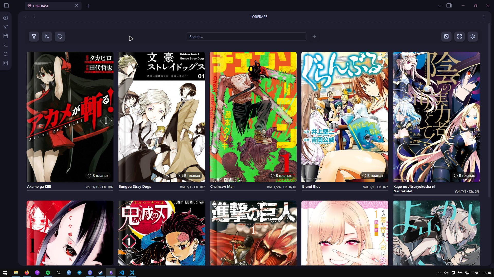
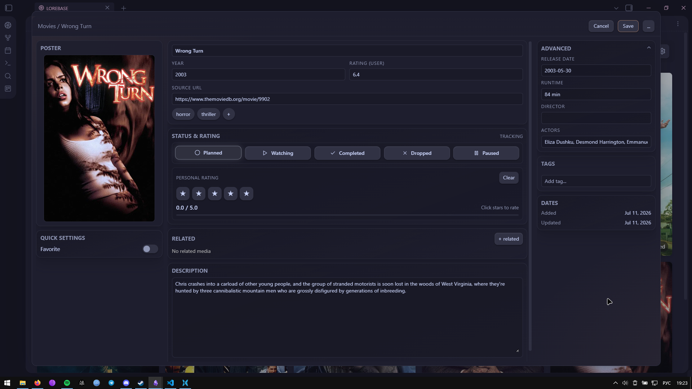
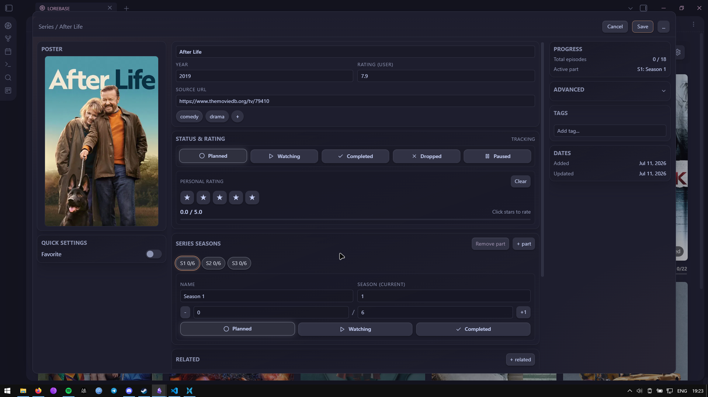
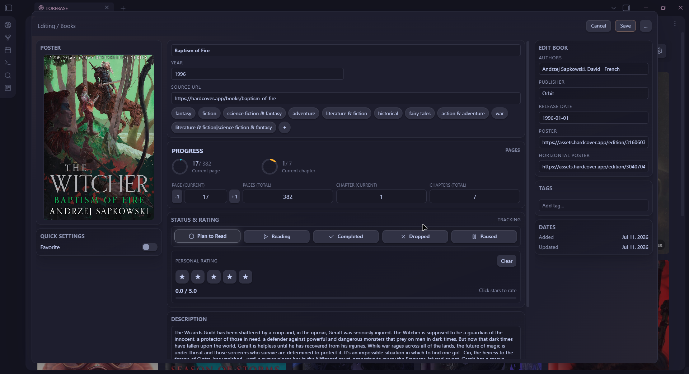
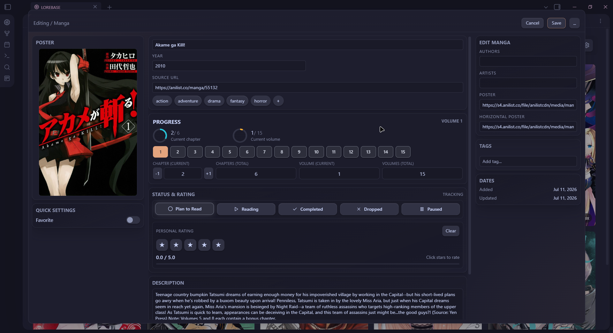

<p align="center">
  
</p>

<p align="center">
  
  
  
  
</p>

<p align="center">
  <a href="https://discord.gg/eTcw8v8c4">
    
  </a>
  <a href="https://ko-fi.com/murch1k">
    
  </a>
  <a href="https://www.patreon.com/c/Murch1k">
    
  </a>
</p>

<h1 align="center">🎮 Lorebase</h1>

<p align="center">
  <strong>Your personal media library inside Obsidian</strong>
  <br />
  <em>Track, organize, and explore your collections — all stored as local Markdown files</em>
</p>

---

## ✨ What is Lorebase?

**Lorebase** transforms your [Obsidian](https://obsidian.md) vault into a full-featured media tracker. Catalog your **games**, **anime**, **movies**, **TV shows**, **books**, and **manga** with card views, rich metadata, progress tracking, and collection statistics — all while keeping your data portable and private as plain Markdown files.

> **🔒 Privacy-first** — No accounts, no cloud sync, no telemetry. Your data never leaves your vault.

---

## 📸 Showcase

<details open>
<summary><strong>🎮 Game Library — Grid View</strong></summary>
<br />
<p align="center">
  
</p>
<p align="center"><em>Browse your game collection with customizable card grids, status badges, and hover overlays</em></p>
</details>

<details>
<summary><strong>📺 Anime Library</strong></summary>
<br />
<p align="center">
  
</p>
<p align="center"><em>Track anime with season/episode progress, format badges (TV, Movie, OVA), and status tracking</em></p>
</details>

<details>
<summary><strong>🎬 Film Library</strong></summary>
<br />
<p align="center">
  
</p>
<p align="center"><em>Browse your movie collection with posters, ratings, and status tracking</em></p>
</details>

<details>
<summary><strong>📺 TV Shows Library</strong></summary>
<br />
<p align="center">
  
</p>
<p align="center"><em>Track shows with season/episode progress and an active-part tracker</em></p>
</details>

<details>
<summary><strong>📖 Book Library</strong></summary>
<br />
<p align="center">
  
</p>
<p align="center"><em>Organize your reading list with page progress, authors, and ratings</em></p>
</details>

<details>
<summary><strong>📚 Manga Library</strong></summary>
<br />
<p align="center">
  
</p>
<p align="center"><em>Track manga with chapter and volume progress</em></p>
</details>

<details>
<summary><strong>✏️ Edit Modal</strong></summary>
<br />

<p align="center">
  
</p>
<p align="center"><em>Game editor with status, rating, tags, progress, and metadata fields.</em></p>

<br />

<p align="center">
  
</p>
<p align="center"><em>Anime editor with title parts, season progress, episode tracking, and metadata fields.</em></p>

<br />

<p align="center">
  
</p>
<p align="center"><em>Film editor with status, rating, genres, and metadata fields.</em></p>

<br />

<p align="center">
  
</p>
<p align="center"><em>TV show editor with season progress, episode tracking, and active-part fields.</em></p>

<br />

<p align="center">
  
</p>
<p align="center"><em>Book editor with author, page progress, and metadata fields.</em></p>

<br />

<p align="center">
  
</p>
<p align="center"><em>Manga editor with chapter and volume progress, and metadata fields.</em></p>

</details>

<details>
<summary><strong>📊 Statistics Dashboard</strong></summary>
<br />
<p align="center">
  
</p>
<p align="center"><em>Visualize your collection with status distribution, rating charts, and key metrics</em></p>
</details>

<details>
<summary><strong>⚙️ Settings</strong></summary>
<br />

<table>
  <tr>
    <td width="33%" align="center"></td>
    <td width="33%" align="center"></td>
    <td width="33%" align="center"></td>
  </tr>
  <tr>
    <td width="33%" align="center"></td>
    <td width="33%" align="center"></td>
    <td width="33%" align="center"></td>
  </tr>
  <tr>
    <td width="33%" align="center"></td>
    <td width="33%" align="center"></td>
    <td width="33%" align="center"></td>
  </tr>
</table>

<p align="center"><em>Deeply customizable settings, now organized in tabs or an accordion layout, with accent colors, card sizes, badge positions, integrations, templates, and more.</em></p>

</details>

---

## 🚀 Features

### 📚 Six Libraries

Lorebase now covers six independent libraries, each with its own statuses, fields, and progress tracking.

| | Games | Anime | Movies 🆕 | TV Shows 🆕 | Books 🆕 | Manga 🆕 |
|---|---|---|---|---|---|---|
| **Statuses** | Not Started, Playing, Completed, Dropped, Sandbox, **Wishlist** 🆕 | Planned, Watching, Completed, Dropped, Paused | Planned, Watching, Completed, Dropped, Paused | Planned, Watching, Completed, Dropped, Paused | Planned, Reading, Completed, Dropped, Paused | Planned, Reading, Completed, Dropped, Paused |
| **Unique fields** | Game series, HowLongToBeat time, developer, publisher | Format (TV/Movie/OVA/ONA/Special), studios, active part | Runtime, director, actors, optional movie parts | Runtime, director, actors, seasons, active season/part | Authors, publisher, pages, chapters | Authors, artists, chapters, volumes, active part |
| **Progress** | Main · Main+Sides · Perfectionist | Season S2/4 · Episode EP 12/24 | Optional movie parts | Season & episode, plus an active-part tracker for shows split into cours/parts | Pages and chapters read / total | Chapters and volumes read / total |

Each library gets its own folder path, card layout, badges, and note template in settings, exactly like Games and Anime did before.

---

### 🧾 Manual Card Creation 🆕

Not every item exists in a metadata provider — now you can add a card by hand, filling in the title, poster, and details yourself, without going through a search.

---

### 🔗 Related Media 🆕

Link local notes together — connect a game to its sequel, a book to its manga adaptation, or a movie to the series it belongs to, directly from within Lorebase.

---

### 🃏 Card Views

<table>
  <tr>
    <td align="center" width="50%">
      
    </td>
    <td align="center" width="50%">
      
    </td>
  </tr>
  <tr>
    <td align="center" width="50%">
      <strong>Vertical Cards</strong><br />
      Classic poster layout with a 2:3 aspect ratio.<br />
      Perfect for game covers, anime posters, and book/manga covers.
    </td>
    <td align="center" width="50%">
      <strong>Horizontal Cards</strong><br />
      Landscape mode with panoramic banners.<br />
      Great for cinematic screenshots and movie/TV banners.
    </td>
  </tr>
</table>

- **3 preset sizes**: Small · Medium · Large
- **Custom dimensions**: Fine-tune width, height, and image ratio
- **Adaptive grid**: Automatically calculates column count based on viewport
- **Virtualized rendering**: Smooth scrolling for 100+ items
- **Horizontal cover support in templates**: note templates can define horizontal/banner posters out of the box

---

### 🏷️ Badges & Overlays

| Badge | Description | Options |
|---|---|---|
| **Status** | Current tracking status with icon | Text + Icon or Icon-only mode |
| **Rating** | Personal 1–5 score | ⭐ Star mode or 😍 Emoji mode |
| **Favorite** | Heart indicator | Static or pulsating animation |
| **Progress** | Season/episode, page, chapter, or volume progress depending on media type | e.g. S 2/4 · EP 12/24 · Ch 45/120 |

All badges have **customizable positions** (X/Y percentage), independently configurable per library, and can be placed anywhere on the card.

**Hover overlay** reveals title, year, format, and description — visibility of each element is configurable.

---

### 🔍 Smart Toolbar

| Control | Description |
|---|---|
| 🔎 **Search** | Real-time search with 150ms debounce |
| 🏷️ **Filters** | By status, favorite, 18+, custom poster |
| ↕️ **Sort** | By name, year, rating, or completion date |
| 🏷️ **Tags** | Plan tags, custom tags, and genres |
| ➕ **Add** | Create new items via metadata integrations or manually |
| 🎲 **Random** | Pick a random item from your collection |
| 🖼️ **View Mode** | Toggle between vertical and horizontal |

---

### 📊 Collection Statistics

A beautiful dashboard modal with:
- **Key metrics**: Total items, completed count, average rating, favorites
- **Status distribution**: Bar charts with percentages
- **Rating distribution**: Emoji-based visualization (😍😊😐😕🤢)
- **Additional info**: Series count, custom posters, completion % — now with per-media-type breakdowns covering movies, TV shows, books, and manga

---

### ✏️ Cinematic Editor

A three-column modal editor inspired by modern CMS design:

<table>
  <tr>
    <td align="center"><strong>📷 Left Column</strong></td>
    <td align="center"><strong>📝 Center Column</strong></td>
    <td align="center"><strong>📋 Right Column</strong></td>
  </tr>
  <tr>
    <td>Poster preview<br />Favorite / 18+ toggles<br />Plan tags</td>
    <td>Title & year<br />Series<br />Genre chips<br />Status (segmented control)<br />Rating (5 stars)<br />Description editor</td>
    <td>HowLongToBeat / reading progress<br />Advanced fields<br />Custom tags<br />Timestamps</td>
  </tr>
</table>

> 🆕 Reworked genre, tag, rating, and status handling across all six libraries.

**Keyboard shortcuts**: `Ctrl+Enter` to save · `Escape` to close

---

### 🌸 Visual Effects

| Effect | Description |
|---|---|
| 🌸 **Sakura** | Gently falling cherry blossom petals |
| ❄️ **Snow** | Soft snowflakes drifting down |

Adjustable intensity from 20 to 150 particles with realistic sway, rotation, and random delays.

---

## 🔗 Integrations

Lorebase can automatically fetch metadata when creating new entries — or you can skip providers entirely and add a card manually.

### Game Providers

| Provider | Description | Requirements |
|---|---|---|
|  | Search Steam Store for games | None |
|  | Import your Steam library and wishlist directly | Steam profile URL |
|  🆕 | Fallback source for high-quality vertical Steam covers | Free API key |
|  | Largest video game database | Free API key |
|  | Internet Game Database — alternative metadata source | Free API key |
|  | Game completion times | None |

### Anime & Manga Providers

| Provider | Description | Requirements |
|---|---|---|
|  | Comprehensive anime database | None |
|  | Russian anime platform | None |
|  🆕 | MyAnimeList metadata through the Jikan API | None |
|  🆕 | Manga database and metadata source | None |

### Movie & TV Providers 🆕

| Provider | Description | Requirements |
|---|---|---|
|  🆕 | Movies and TV shows, posters and metadata | Free API key |
|  🆕 | TV show schedules and metadata | None |
|  🆕 | Movie and TV metadata via IMDb data | Free API key |

### Book Providers 🆕

| Provider | Description | Requirements |
|---|---|---|
|  🆕 | Book tracking and metadata | Free API key |
|  🆕 | Large book metadata database | Optional API key |

> 🧪 *Experimental*: download a poster from any URL straight to local storage instead of linking it remotely.

---

## 📦 Installation

### Community Plugin

1. Open **Settings → Community plugins**
2. Search for **Lorebase**
3. Install and enable the plugin

### Manual Installation

1. Download the latest release from [GitHub Releases](https://github.com/Murchi1k/obsidian-lorebase-plugin/releases)
2. Copy these files into your vault's plugin folder:

   ```
   <Vault>/.obsidian/plugins/lorebase/
   ├── main.js
   ├── manifest.json
   └── styles.css
   ```

3. Restart Obsidian or reload plugins
4. Open **Settings → Community plugins** and enable **Lorebase**

### Build from Source

```bash
# Install dependencies
npm install

# Build the plugin
npm run build

# Run tests
npm test

# Type checking
npm run typecheck
```

---

## 🎯 Getting Started

1. **Open Lorebase** — Click the Lorebase icon in the ribbon, or use the command palette (`Ctrl+P` → "Lorebase")
2. **Choose your library** — Switch between Games, Anime, Movies, TV Shows, Books, and Manga tabs
3. **Add your first item** — Click the ➕ button to search via configured providers, or create a card manually
4. **Review & create** — Select a result, review the metadata, and create a note
5. **Edit details** — Right-click any card to edit status, rating, tags, and more

### Quick Actions via Context Menu

Right-click any card to:
- 🎯 Change status instantly
- ⭐ Set rating
- ❤️ Toggle favorite
- ✏️ Open full editor
- 🗑️ Delete item

---

## ⚙️ Settings

### General

| Setting | Description | Options |
|---|---|---|
| **Language** | Interface language | English, Russian, Ukrainian |
| **Accent Color** | Theme accent | 10 presets + custom hex |
| **Particle Effect** | Ambient particles | None, Sakura, Snow |
| **Particle Intensity** | Number of particles | 20–150 |
| **Settings Layout** 🆕 | How settings sections are displayed | Tabs or Accordion |

### Library Settings *(per media type)*

Now available independently for **Games, Anime, Movies, TV Shows, Books, and Manga**.

| Setting | Description |
|---|---|
| **Folder Path** | Vault folder for this library |
| **Card Size** | Small / Medium / Large |
| **Card Orientation** | Vertical or Horizontal |
| **Custom Dimensions** | Fine-tune card width, height, ratio |
| **Columns** | Grid column count |

### Card Appearance

- **Overlay text**: Position and visibility of title, year, format, description
- **Badges**: Position, mode, and style for status, rating, and favorite
- **Description lines**: Number of visible lines in hover overlay (1–70)
- **Progress badges**: Season/episode, page, chapter, or volume progress, depending on media type
- **Card style**: Hover overlay or progress-footer cards where supported
- **Book cover effect**: Hardcover-style cards for books and manga

### Integrations

- Toggle each provider on/off
- Enter API keys where required (RAWG, IGDB, SteamGridDB, TMDB, OMDb, Hardcover) or recommended (Google Books)
- Select default provider per media type
- Configure note templates per media type (simple field list or advanced YAML), including dedicated templates for movies, TV shows, books, and manga

---

## 📝 Data Format

Every library item is a Markdown file with YAML frontmatter. You can edit them directly or through the Lorebase UI.

Lorebase stores progress fields in snake_case. For books and manga, the UI may display the `watching` status as Reading, but the saved status value remains `watching`.

<details>
<summary><strong>🎮 Game Example</strong></summary>

```yaml
---
name: "The Witcher 3: Wild Hunt"
poster: "https://example.com/game-cover.jpg"
poster_b: "https://example.com/game-banner.jpg"
gameSeries: "The Witcher"
genres:
  - "RPG"
  - "Action"
plot: "You play as Geralt of Rivia, a monster hunter..."
platforms: "PC, PS4, Xbox One, Nintendo Switch"
year: "2015"
released: "2015-05-19"
developers:
  - "CD Projekt Red"
publishers:
  - "CD Projekt"
rating: "4"
userRating: 5
status: "completed"
favorite: true
url: "https://store.steampowered.com/app/292030"
main: "51 hours"
main_plus_sides: "103 hours"
perfectionist: "173 hours"
---

## My Notes

Amazing open-world RPG with incredible storytelling...
```

</details>

<details>
<summary><strong>📺 Anime Example</strong></summary>

```yaml
---
title: "Attack on Titan"
image: "https://example.com/anime-cover.jpg"
image_b: "https://example.com/anime-banner.jpg"
plot: "In a world where humanity lives within enormous walled cities..."
scoreImdb: "84"
tags: "action, drama, fantasy"
year: "2013"
studios: "Wit Studio, MAPPA"
format: "tv"
season_current: "4"
episode_current: "87"
episode_total: "87"
active_part_id: "season-4"
anime_parts:
  - id: "season-4"
    kind: "tv"
    title: "Season 4"
    season: 4
    episode_current: 87
    episode_total: 87
    status: "completed"
rating: "5"
status: "completed"
favorite: true
url: "https://anilist.co/anime/16498"
---

## My Notes

One of the greatest anime of all time...
```

</details>

<details>
<summary><strong>🎬 Movie Example</strong> 🆕</summary>

```yaml
---
type: "movie"
title: "Blade Runner 2049"
poster: "https://example.com/movie-poster.jpg"
poster_b: "https://example.com/movie-banner.jpg"
plot: "A young blade runner uncovers a secret that could destabilize society..."
genres: "Sci-Fi, Drama"
year: "2017"
released: "2017-10-06"
runtime: "164 min"
director: "Denis Villeneuve"
actors: "Ryan Gosling, Harrison Ford, Ana de Armas"
rating: "5"
status: "completed"
favorite: true
active_part_id: ""
movie_parts: []
integration_provider: "tmdb"
integration_id: "335984"
url: "https://www.themoviedb.org/movie/335984"
---

## My Notes

A slow, visual sci-fi sequel with a strong atmosphere...
```

</details>

<details>
<summary><strong>📺 TV Show Example</strong> 🆕</summary>

```yaml
---
type: "series"
title: "The Boys"
poster: "https://example.com/series-poster.jpg"
poster_b: "https://example.com/series-banner.jpg"
plot: "A group of vigilantes takes on corrupt superheroes..."
genres: "Action, Drama, Superhero"
year: "2019"
released: "2019-07-26"
runtime: "60 min"
director: ""
actors: "Karl Urban, Jack Quaid, Antony Starr"
seasons: "4"
episode_current: "39"
episode_total: "40"
active_part_id: "season-4"
series_parts:
  - id: "season-4"
    kind: "season"
    title: "Season 4"
    season: 4
    episode_current: 7
    episode_total: 8
    status: "watching"
rating: "4"
status: "watching"
favorite: false
integration_provider: "tmdb"
integration_id: "76479"
url: "https://www.themoviedb.org/tv/76479"
---

## My Notes

Season tracking works through series_parts and active_part_id...
```

</details>

<details>
<summary><strong>📖 Book Example</strong> 🆕</summary>

```yaml
---
type: "book"
title: "Dune"
poster: "https://example.com/dune-cover.jpg"
poster_b: "https://example.com/dune-banner.jpg"
plot: "A story of politics, religion, and power on the desert planet Arrakis..."
authors: "Frank Herbert"
publisher: "Chilton Books"
genres: "Sci-Fi"
tags: "classic, space opera"
year: "1965"
released: "1965-08-01"
page_current: "210"
page_total: "412"
chapter_current: "8"
chapter_total: "22"
rating: "5"
status: "watching"
favorite: true
integration_provider: "googlebooks"
integration_id: "example"
url: "https://www.google.com/books/edition/Dune/example"
---

## My Notes

A dense but rewarding classic...
```

</details>

<details>
<summary><strong>📚 Manga Example</strong> 🆕</summary>

```yaml
---
type: "manga"
title: "Berserk"
poster: "https://example.com/berserk-cover.jpg"
poster_b: "https://example.com/berserk-banner.jpg"
plot: "Guts, a lone mercenary, fights against demonic forces..."
authors: "Kentaro Miura"
artists: "Kentaro Miura"
genres: "Dark Fantasy, Action"
tags: "seinen, tragedy"
year: "1989"
chapter_current: "364"
chapter_total: "379"
volume_current: "41"
volume_total: "42"
active_part_id: "volume-41"
manga_parts:
  - id: "volume-41"
    kind: "volume"
    title: "Volume 41"
    volume: 41
    chapter_current: 364
    chapter_total: 379
    status: "watching"
rating: "5"
status: "watching"
favorite: true
integration_provider: "mangadex"
integration_id: "example"
url: "https://mangadex.org/title/example"
---

## My Notes

One of the most influential dark fantasy manga...
```

</details>

---

## ⚡ Performance

Lorebase is optimized for large collections:

- **Virtualized rendering** — Only visible cards are in the DOM
- **Batch card rendering** — 24 cards per animation frame
- **O(1) file lookups** — Map-based index for instant access
- **Debounced search** — Search input updates are throttled
- **RAF-based scroll rendering** — Virtual grid updates are aligned with animation frames
- **SVG template caching** — Icons use `cloneNode` instead of `innerHTML`
- **ResizeObserver** — Adaptive layout without polling

---

## 🌍 Localization

| Language | Status |
|---|---|
| 🇬🇧 English | ✅ Full |
| 🇷🇺 Russian | ✅ Full |
| 🇺🇦 Ukrainian | 🧪 Beta |

All core UI elements, status labels, settings descriptions, and error messages are translated, including all new media types and providers. Ukrainian is new in 2.0.0 and marked as beta while community wording is reviewed.

---

## 📋 Changelog

<details open>
<summary><strong>v2.0.0</strong></summary>
<br />

**Added**
- 🎬 **New media types** — Movies, TV Shows, Books, and Manga are now fully supported as standalone libraries
- 🔎 **New metadata providers** — TMDB, TVmaze, OMDb, Hardcover, Google Books, Jikan, and MangaDex
- 🧾 **Manual card creation** — add media without searching through a provider
- 🖼️ **SteamGridDB** — fallback source for high-quality vertical Steam covers
- 📚 **Reading progress** — pages, chapters, volumes, and manga progress tracking
- 📺 **Show progress** — seasons, episodes, and an active-part tracker for shows
- 🔗 **Related media** — link local notes to each other
- 🎛️ **New per-media settings** — dedicated folders, templates, badges, and appearance for each media type
- 🃏 **Card style modes** — choose between hover overlay cards and progress-footer cards where supported
- 📘 **Book cover effect** — optional hardcover-style cards for books and manga
- 🇺🇦 **Ukrainian localization** — new beta interface language
- ⭐ **Wishlist status** for games
- 🧩 **New templates** — dedicated note templates for movies, TV shows, books, and manga

**Improved**
- Fully reworked plugin settings
- Added a tabbed or accordion layout mode for settings
- Added folder suggestions for library paths and image storage paths
- Added per-media preview controls for card appearance settings
- Improved library cards and progress display
- Updated editor modals
- Improved manual creation with cover URL/file support and media-specific fields
- Improved genre and tag editing in modals
- Improved handling of genres, tags, ratings, and statuses
- Improved Steam Sync and Steam image matching
- Improved handling of local and remote posters
- Improved Russian and English localization
- Expanded statistics to cover all new media types

**Stabilized during 2.0.0 development**
- Removed the obsolete Coming Soon / In development settings section
- Fixed book add flow using the wrong cover or metadata after selecting a search result
- Fixed manga add flow resetting selection when searching for another title
- Book and manga hover overlays have stronger background readability
- Book and manga card text sizing is more readable
- Anime and TV progress-footer cards keep the same hover behavior as books and manga
- Manga hover cards now lift consistently in hover mode
- Anime virtual-grid progress footers no longer overlap the next row
- Anime and TV season/part chips now use status colors consistently
- README data format examples now match the current snake_case frontmatter fields

</details>

<details>
<summary><strong>v1.1.0</strong></summary>
<br />

**Added**
- 🔄 **Steam Sync** — import your Steam library and wishlist directly
-  **IGDB provider** for game metadata
- 🤖 **Anime Title Parts** auto-fill
- 🖼️ Horizontal cover support in templates
- 🧪 *Experimental*: poster download from URL to local storage

**Improved**
- Small redesign of the add window
- HowLongToBeat integration

**Fixed**
- Support buttons in settings
- Dropdown formatting under description
- Removed unnecessary media providers block

</details>

---

## 📄 License

[MIT](LICENSE) © [Murch1k](https://github.com/Murchi1k)

---

<p align="center">
  <strong>Built with ❤️ for Obsidian</strong>
  <br />
  <em>Your media library stays local, clear, and fully under your control</em>
</p>
