<p align="center">
  
</p>

<p align="center">
  
  
  
  
</p>

<p align="center">
  <a href="https://discord.gg/eTcw8v8c4">
    
  </a>
  <a href="https://ko-fi.com/murch1k">
    
  </a>
  <a href="https://www.patreon.com/c/Murch1k">
    
  </a>
</p>

<h1 align="center">🎮 Lorebase</h1>

<p align="center">
  <strong>Your personal media library inside Obsidian</strong>
  <br />
  <em>Track, organize, and explore your collections — all stored as local Markdown files</em>
</p>

---

## ✨ What is Lorebase?

**Lorebase** transforms your [Obsidian](https://obsidian.md) vault into a full-featured media tracker. Catalog your **games**, **anime**, and future media collections with card views, rich metadata, progress tracking, and collection statistics — all while keeping your data portable and private as plain Markdown files.

> **🔒 Privacy-first** — No accounts, no cloud sync, no telemetry. Your data never leaves your vault.

---

## 📸 Showcase

<details open>
<summary><strong>🎮 Game Library — Grid View</strong></summary>
<br />
<p align="center">
  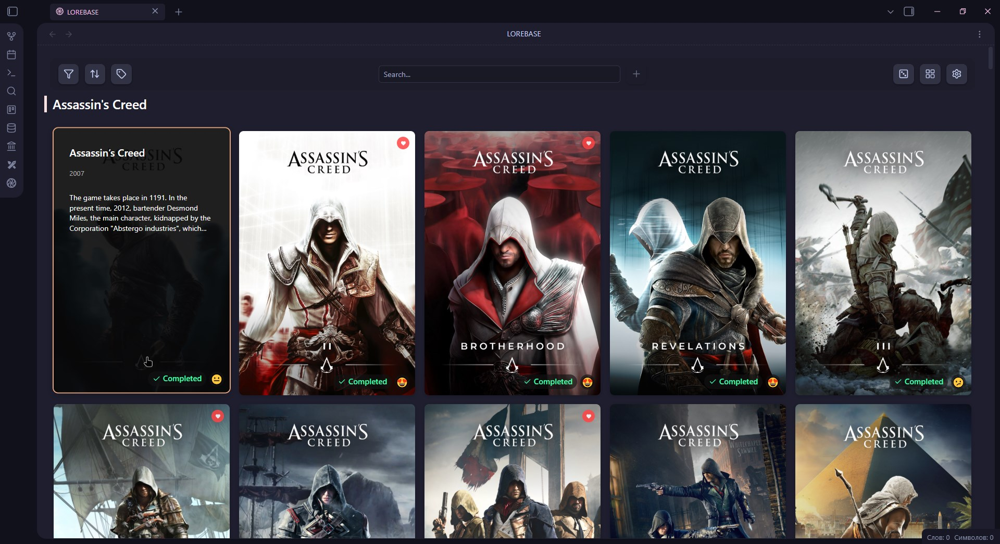
</p>
<p align="center"><em>Browse your game collection with customizable card grids, status badges, and hover overlays</em></p>
</details>

<details>
<summary><strong>📺 Anime Library</strong></summary>
<br />
<p align="center">
  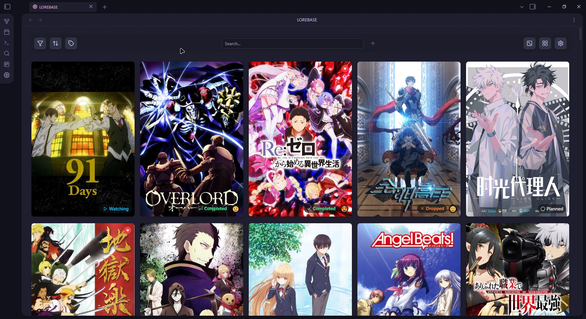
</p>
<p align="center"><em>Track anime with season/episode progress, format badges (TV, Movie, OVA), and status tracking</em></p>
</details>

<details>
<summary><strong>✏️ Edit Modal</strong></summary>
<br />

<p align="center">
  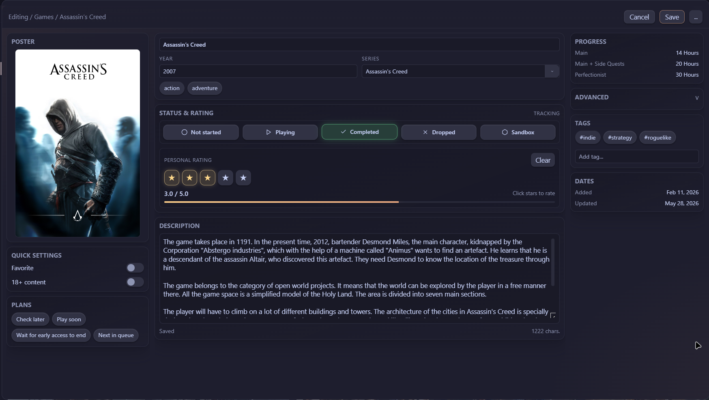
</p>
<p align="center"><em>Game editor with status, rating, tags, progress, and metadata fields.</em></p>

<br />

<p align="center">
  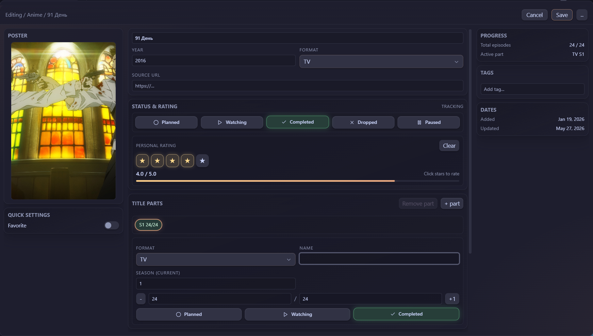
</p>
<p align="center"><em>Anime editor with title parts, season progress, episode tracking, and metadata fields.</em></p>

</details>

<details>
<summary><strong>📊 Statistics Dashboard</strong></summary>
<br />
<p align="center">
  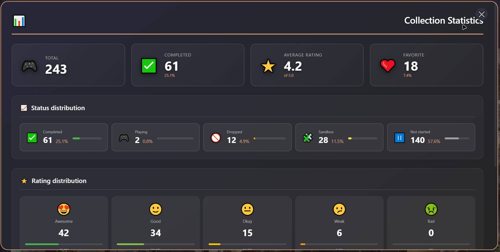
</p>
<p align="center"><em>Visualize your collection with status distribution, rating charts, and key metrics</em></p>
</details>

<details>
<summary><strong>⚙️ Settings</strong></summary>
<br />

<table>
  <tr>
    <td width="33%" align="center">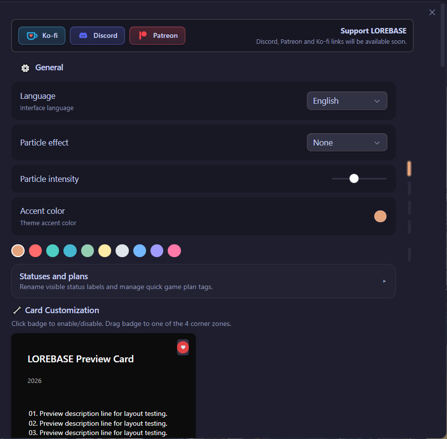</td>
    <td width="33%" align="center">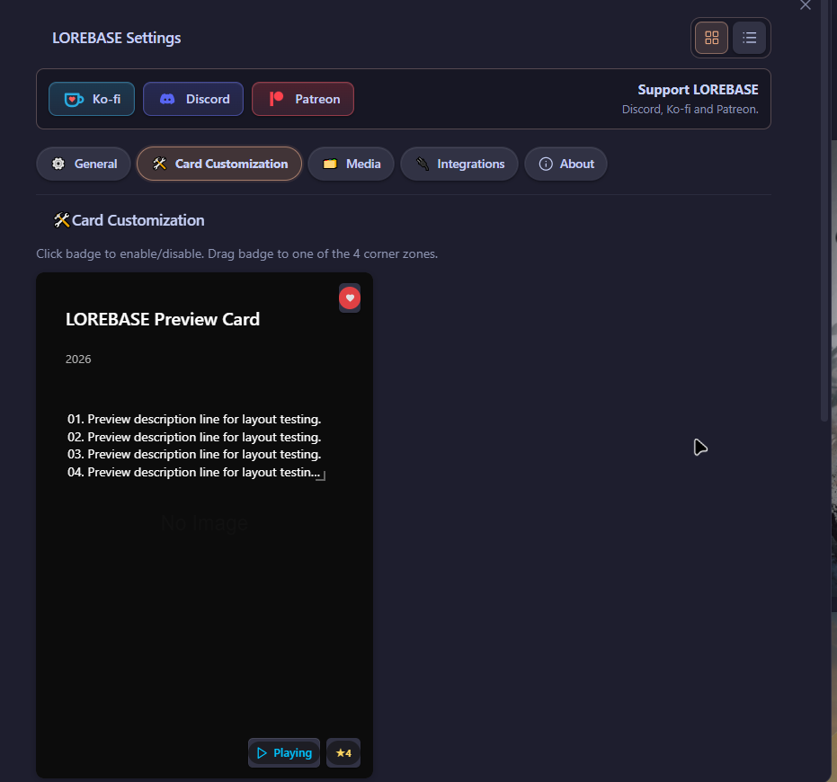</td>
    <td width="33%" align="center">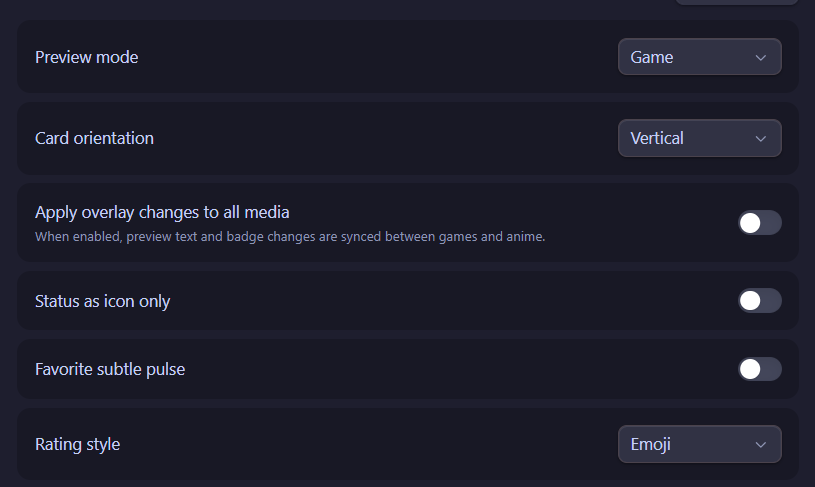</td>
  </tr>
  <tr>
    <td width="33%" align="center">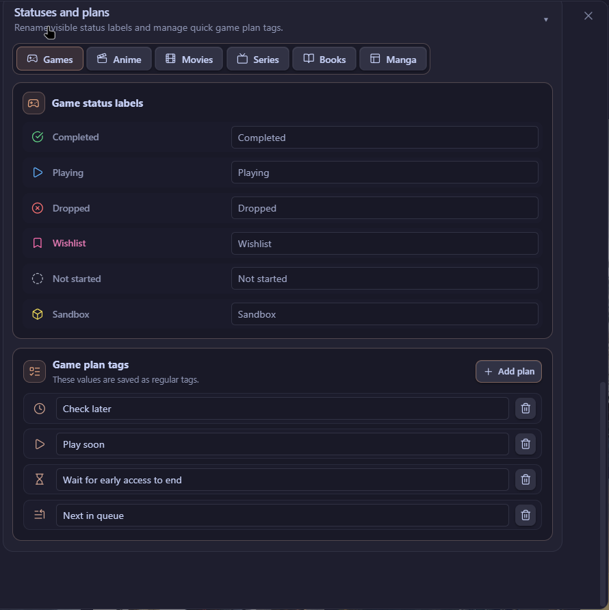</td>
    <td width="33%" align="center">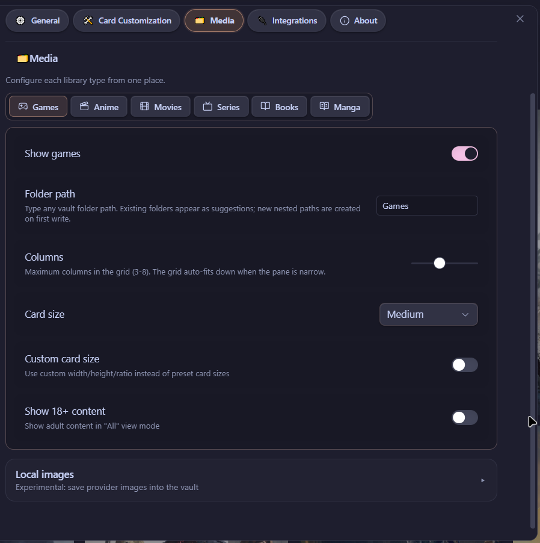</td>
    <td width="33%" align="center">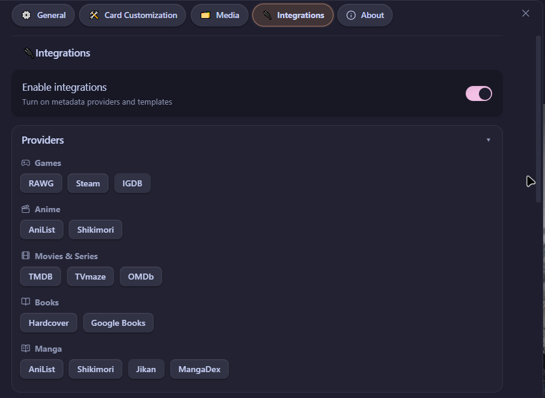</td>
  </tr>
  <tr>
    <td width="33%" align="center">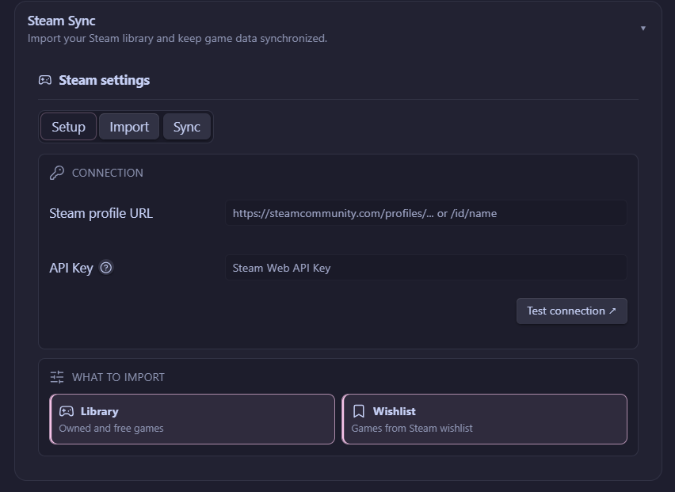</td>
    <td width="33%" align="center">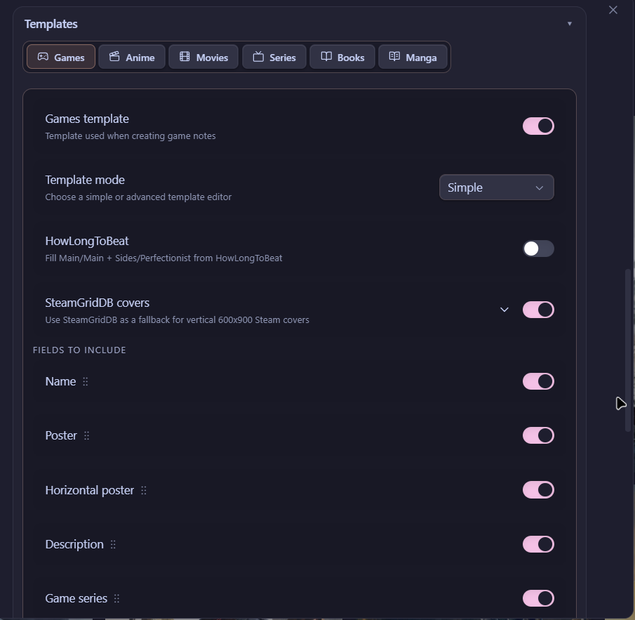</td>
    <td width="33%" align="center">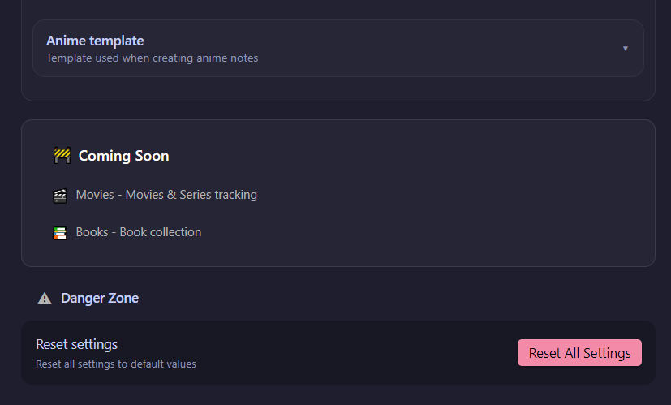</td>
  </tr>
</table>

<p align="center"><em>Deeply customizable settings with accent colors, card sizes, badge positions, integrations, templates, and more.</em></p>

</details>

---

## 🚀 Features

### 📚 Dual Libraries

| | Games | Anime |
|---|---|---|
| **Statuses** | Not Started, Playing, Completed, Dropped, Sandbox | Planned, Watching, Completed, Dropped, Paused |
| **Unique fields** | Game series, HowLongToBeat time, developer, publisher | Format (TV/Movie/OVA/ONA/Special), season/episode progress, studios |
| **Progress** | Main · Main+Sides · Perfectionist | Season S2/4 · Episode EP 12/24 |

---

### 🃏 Card Views

<table>
  <tr>
    <td align="center" width="50%">
      
    </td>
    <td align="center" width="50%">
      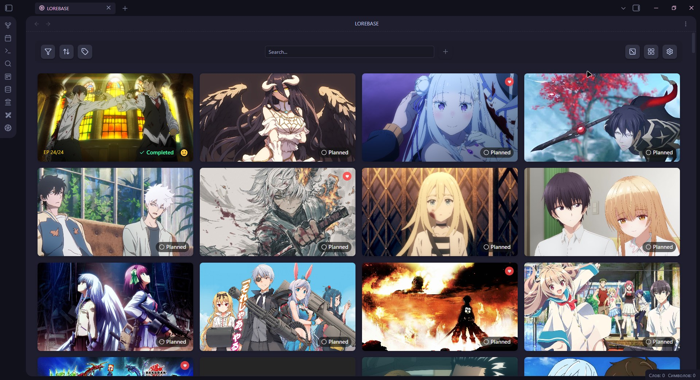
    </td>
  </tr>
  <tr>
    <td align="center" width="50%">
      <strong>Vertical Cards</strong><br />
      Classic poster layout with a 2:3 aspect ratio.<br />
      Perfect for game covers and anime posters.
    </td>
    <td align="center" width="50%">
      <strong>Horizontal Cards</strong><br />
      Landscape mode with panoramic banners.<br />
      Great for cinematic screenshots.
    </td>
  </tr>
</table>

- **3 preset sizes**: Small · Medium · Large
- **Custom dimensions**: Fine-tune width, height, and image ratio
- **Adaptive grid**: Automatically calculates column count based on viewport
- **Virtualized rendering**: Smooth scrolling for 100+ items
- **Horizontal cover support in templates** 🆕 *(v1.1.0)*: note templates can now define horizontal/banner posters out of the box

---

### 🏷️ Badges & Overlays

| Badge | Description | Options |
|---|---|---|
| **Status** | Current tracking status with icon | Text + Icon or Icon-only mode |
| **Rating** | Personal 1–5 score | ⭐ Star mode or 😍 Emoji mode |
| **Favorite** | Heart indicator | Static or pulsating animation |
| **Progress** | Anime season & episode count | S 2/4 · EP 12/24 |

All badges have **customizable positions** (X/Y percentage) and can be placed anywhere on the card.

**Hover overlay** reveals title, year, format, and description — visibility of each element is configurable.

---

### 🔍 Smart Toolbar

| Control | Description |
|---|---|
| 🔎 **Search** | Real-time search with 150ms debounce |
| 🏷️ **Filters** | By status, favorite, 18+, custom poster |
| ↕️ **Sort** | By name, year, rating, or completion date |
| 🏷️ **Tags** | Plan tags, custom tags, and genres |
| ➕ **Add** | Create new items via metadata integrations |
| 🎲 **Random** | Pick a random item from your collection |
| 🖼️ **View Mode** | Toggle between vertical and horizontal |

---

### 📊 Collection Statistics

A beautiful dashboard modal with:
- **Key metrics**: Total items, completed count, average rating, favorites
- **Status distribution**: Bar charts with percentages
- **Rating distribution**: Emoji-based visualization (😍😊😐😕🤢)
- **Additional info** *(games only)*: Series count, custom posters, completion %

---

### ✏️ Cinematic Editor

A three-column modal editor inspired by modern CMS design:

<table>
  <tr>
    <td align="center"><strong>📷 Left Column</strong></td>
    <td align="center"><strong>📝 Center Column</strong></td>
    <td align="center"><strong>📋 Right Column</strong></td>
  </tr>
  <tr>
    <td>Poster preview<br />Favorite / 18+ toggles<br />Plan tags</td>
    <td>Title & year<br />Series<br />Genre chips<br />Status (segmented control)<br />Rating (5 stars)<br />Description editor</td>
    <td>HowLongToBeat progress<br />Advanced fields<br />Custom tags<br />Timestamps</td>
  </tr>
</table>

> 🆕 *v1.1.0*: Anime **Title Parts auto-fill** — main title, season title, and part numbers are parsed and filled in automatically when adding a new entry.

**Keyboard shortcuts**: `Ctrl+Enter` to save · `Escape` to close

---

### 🌸 Visual Effects

| Effect | Description |
|---|---|
| 🌸 **Sakura** | Gently falling cherry blossom petals |
| ❄️ **Snow** | Soft snowflakes drifting down |

Adjustable intensity from 20 to 150 particles with realistic sway, rotation, and random delays.

---

## 🔗 Integrations

Lorebase can automatically fetch metadata when creating new entries:

> 🧪 *Experimental (v1.1.0)*: download a poster from any URL straight to local storage instead of linking it remotely.

### Game Providers

| Provider | Description | Requirements |
|---|---|---|
|  | Search Steam Store for games | None |
|  🆕 | Import your Steam library and wishlist directly | Steam profile URL |
|  | Largest video game database | Free API key |
|  🆕 | Internet Game Database — alternative metadata source | Free API key |
|  | Game completion times — broken integration fixed in v1.1.0 | None |

### Anime Providers

| Provider | Description | Requirements |
|---|---|---|
|  | Comprehensive anime database | None |
|  | Russian anime platform | None |

---

## 📦 Installation

### Community Plugin

1. Open **Settings → Community plugins**
2. Search for **Lorebase**
3. Install and enable the plugin

### Manual Installation

1. Download the latest release from [GitHub Releases](https://github.com/Murchi1k/obsidian-lorebase-plugin/releases)
2. Copy these files into your vault's plugin folder:

   ```
   <Vault>/.obsidian/plugins/lorebase/
   ├── main.js
   ├── manifest.json
   └── styles.css
   ```

3. Restart Obsidian or reload plugins
4. Open **Settings → Community plugins** and enable **Lorebase**

### Build from Source

```bash
# Install dependencies
npm install

# Build the plugin
npm run build

# Run tests
npm test

# Type checking
npm run typecheck
```

---

## 🎯 Getting Started

1. **Open Lorebase** — Click the Lorebase icon in the ribbon, or use the command palette (`Ctrl+P` → "Lorebase")
2. **Choose your library** — Switch between Games and Anime tabs
3. **Add your first item** — Click the ➕ button to search via configured providers *(redesigned add window in v1.1.0)*
4. **Review & create** — Select a result, review the metadata, and create a note
5. **Edit details** — Right-click any card to edit status, rating, tags, and more

### Quick Actions via Context Menu

Right-click any card to:
- 🎯 Change status instantly
- ⭐ Set rating
- ❤️ Toggle favorite
- ✏️ Open full editor
- 🗑️ Delete item

---

## ⚙️ Settings

### General

| Setting | Description | Options |
|---|---|---|
| **Language** | Interface language | English, Russian |
| **Accent Color** | Theme accent | 10 presets + custom hex |
| **Particle Effect** | Ambient particles | None, Sakura, Snow |
| **Particle Intensity** | Number of particles | 20–150 |

### Library Settings *(per media type)*

| Setting | Description |
|---|---|
| **Folder Path** | Vault folder for this library |
| **Card Size** | Small / Medium / Large |
| **Card Orientation** | Vertical or Horizontal |
| **Custom Dimensions** | Fine-tune card width, height, ratio |
| **Columns** | Grid column count |

### Card Appearance

- **Overlay text**: Position and visibility of title, year, format, description
- **Badges**: Position, mode, and style for status, rating, and favorite
- **Description lines**: Number of visible lines in hover overlay (1–70)
- **Anime progress**: Toggle season and episode badges

### Integrations

- Toggle each provider on/off
- Enter API keys (RAWG)
- Select default provider per media type
- Configure note templates (simple field list or advanced YAML)

---

## 📝 Data Format

Every library item is a Markdown file with YAML frontmatter. You can edit them directly or through the Lorebase UI.

<details>
<summary><strong>🎮 Game Example</strong></summary>

```yaml
---
poster: "https://example.com/game-cover.jpg"
gameSeries: "The Witcher"
genres:
  - "RPG"
  - "Action"
plot: "You play as Geralt of Rivia, a monster hunter..."
platforms: "PC, PS4, Xbox One, Nintendo Switch"
year: "2015"
released: "2015-05-19"
developers:
  - "CD Projekt Red"
publishers:
  - "CD Projekt"
rating: "4"
userRating: 5
status: "completed"
favorite: true
url: "https://store.steampowered.com/app/292030"
main: "51 hours"
main_plus_sides: "103 hours"
perfectionist: "173 hours"
---

## My Notes

Amazing open-world RPG with incredible storytelling...
```

</details>

<details>
<summary><strong>📺 Anime Example</strong></summary>

```yaml
---
name: "Attack on Titan"
image: "https://example.com/anime-cover.jpg"
plot: "In a world where humanity lives within enormous walled cities..."
scoreImdb: "84"
tags: "action, drama, fantasy"
year: "2013"
studios: "Wit Studio, MAPPA"
format: "tv"
rating: 5
status: "completed"
favorite: true
url: "https://anilist.co/anime/16498"
seasonCurrent: 4
seasonTotal: 4
episodeCurrent: 87
episodeTotal: 87
---

## My Notes

One of the greatest anime of all time...
```

</details>

---

## ⚡ Performance

Lorebase is optimized for large collections:

- **Virtualized rendering** — Only visible cards are in the DOM
- **Batch card rendering** — 24 cards per animation frame
- **O(1) file lookups** — Map-based index for instant access
- **Debounced inputs** — Search and scroll events are throttled
- **SVG template caching** — Icons use `cloneNode` instead of `innerHTML`
- **ResizeObserver** — Adaptive layout without polling

---

## 🌍 Localization

| Language | Status |
|---|---|
| 🇬🇧 English | ✅ Full |
| 🇷🇺 Russian | ✅ Full |

All UI elements, status labels, settings descriptions, and error messages are fully translated.

---

## 📋 Changelog

<details open>
<summary><strong>v1.1.0</strong></summary>
<br />

**Added**
- 🔄 **Steam Sync** — import your Steam library and wishlist directly
-  **IGDB provider** for game metadata
- 🤖 **Anime Title Parts** auto-fill
- 🖼️ Horizontal cover support in templates
- 🧪 *Experimental*: poster download from URL to local storage

**Improved**
- Small redesign of the add window
- HowLongToBeat integration

**Fixed**
- Support buttons in settings
- Dropdown formatting under description
- Removed unnecessary media providers block

</details>

---

## 📄 License

[MIT](LICENSE) © [Murch1k](https://github.com/Murchi1k)

---

<p align="center">
  <strong>Built with ❤️ for Obsidian</strong>
  <br />
  <em>Your media library stays local, clear, and fully under your control</em>
</p>